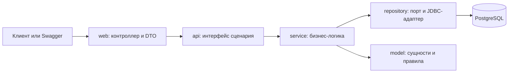
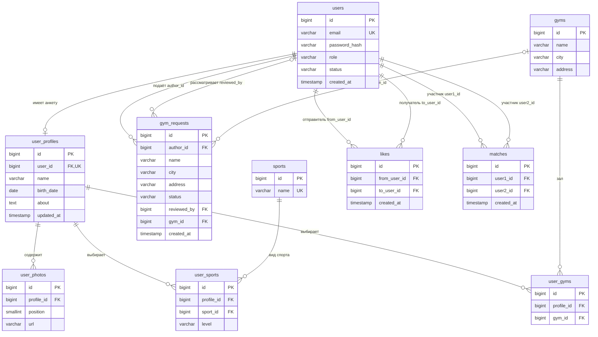

# GymBro

GymBro - это монолитный REST API для поиска партнёров по тренировкам. Пользователи
заполняют анкеты, выбирают виды спорта и залы, просматривают ленту и ставят лайки.
Взаимный лайк создаёт мэтч.


## Запуск

Из корня проекта:

```powershell
Copy-Item .env.example .env
docker compose up --build
```

Копирование нужно при первом запуске, если `.env` ещё не создан. Уже заполненный
файл следует сохранить. Compose может работать и с заданными в нём значениями
по умолчанию.

- Swagger UI: http://localhost:8080/swagger-ui.html
- OpenAPI JSON: http://localhost:8080/v3/api-docs


## Модули и слои

Все модули находятся в `src/main/java/ru/itmo/gymbro`.

| Модуль | Ответственность |
|---|---|
| `identity` | Учётные записи, BCrypt-хеширование паролей, роли, статусы, текущий пользователь |
| `catalog` | CRUD видов спорта и залов, подача и рассмотрение заявок |
| `profile` | Анкеты, фотографии, выбранные виды спорта с уровнем и залы |
| `matching` | Лента, лайки, создание и просмотр совпадений |
| `shared` | Ошибки, валидация перед сохранением, пагинация, OpenAPI |



- `web` отвечает за HTTP-методы, пути, входную валидацию и статусы ответа.
- `dto` описывает запросы и ответы. Entity напрямую в HTTP не отдаётся;
  например, хеш пароля отсутствует в `UserResponse`.
- `api` — Java-интерфейсы сценариев для контроллеров и других модулей.
- `service` проверяет права и бизнес-условия, задаёт границы транзакций.
- `model` содержит сущности, enum и инварианты.
- `repository` отделяет операции хранения от реализации Spring Data JDBC.
  DAO предоставляет стандартные операции, а JDBC-адаптер — необходимые SQL-запросы.

Spring создаёт компоненты и связывает их через конструкторы. Между модулями
используются публичные контракты `api` и разрешённые модели; внутренние сервисы
другого модуля напрямую не вызываются. ArchUnit проверяет архитектурные ограничения.
Модули `events` и `training` в эту лабораторную не входят.

## Схема БД



Типы связей:

- One-to-Many / Many-to-One: анкета и фотографии.
- Many-to-Many: анкеты и залы через `user_gyms`.
- Many-to-Many с дополнительным полем: анкеты и виды спорта через `user_sports.level`.
- Дополнительно One-to-One: учётная запись и необязательная анкета.

Уникальны email пользователя, название спорта, пара `(city, address)` зала,
направленная пара отправитель/получатель лайка и пара участников совпадения.
В дочерних таблицах профиля есть собственные PK `id` и составные UNIQUE:
`(profile_id, position)`, `(profile_id, sport_id)`, `(profile_id, gym_id)`.
У совпадения меньший ID всегда записывается в `user1_id`: пара A–B и B–A одна и та же.
Enum сохраняются строками: роли, статусы и уровень подготовки. Допустимые значения
дополнительно ограничены в миграциях.

`UserProfile` — агрегат Spring Data JDBC: фотографии, выбранные виды спорта и залы
сохраняются вместе с анкетой через `@MappedCollection`. Между агрегатами хранятся ID.
Аннотации JPA `@ManyToMany` здесь не используются; связи обеспечивают таблицы и FK.

## Liquibase и валидация

Главный файл — `src/main/resources/db/changelog/db.changelog-master.yaml`.
Он подключает миграции identity → catalog → profile → matching, чтобы таблицы,
на которые ссылаются внешние ключи, уже существовали.

Liquibase читает changeset, выполняет ещё не применённые изменения и записывает
их в `DATABASECHANGELOG`. `DATABASECHANGELOGLOCK` координирует запуск миграций.
Повторный старт приложения не создаёт таблицы заново. Для развития схемы добавляют
новые changeset; уже применённые миграции обычно не переписывают.

Проверки выполняются на трёх уровнях: `@Valid` для DTO в контроллере,
Jakarta Validation через `ValidateBeforeSaveCallback` для сущностей,
а также ограничения PostgreSQL — NOT NULL, UNIQUE, CHECK и внешние ключи.

## Права доступа

Текущий пользователь временно определяется заголовком `X-User-Id`.
В Swagger кнопка **Authorize** принимает существующий ID. Роль не передаётся
в запросе: `CurrentUserAccess` читает её из БД. Администратор - пользователь
с ролью `ADMIN`. `USER` и `TRAINER` не имеют административных прав.

Изменять и удалять зал, просматривать и рассматривать заявки может только администратор. Одобрение заявки не привязывает зал к её автору.
Прямое создание зала, CRUD спорта и CRUD пользователей пока не ограничены ролью;
таблица ниже отражает фактическое поведение. Доступ к этим операциям — отдельная
задача, текущая правка ограничивает только изменение и удаление залов.

## Эндпоинты

Префикс всех путей — `/api/v1`. 
В колонке ответа перечислены успешные статусы. Ошибки описаны ниже и в Swagger.

| Метод | Путь | Доступ | Успех | Пагинация |
|---|---|---|---|---|
| POST | `/users` | Открыто | 201 + Location | — |
| GET | `/users/{id}` | Открыто | 200 | — |
| GET | `/users` | Открыто | 200 | Page + X-Total-Count |
| PATCH | `/users/{id}` | Открыто | 200 | — |
| DELETE | `/users/{id}` | Открыто | 204 | — |
| POST | `/sports` | Открыто | 201 + Location | — |
| GET | `/sports/{id}` | Открыто | 200 | — |
| GET | `/sports` | Открыто | 200 | Page + X-Total-Count |
| PUT | `/sports/{id}` | Открыто | 200 | — |
| DELETE | `/sports/{id}` | Открыто | 204 | — |
| POST | `/gyms` | Открыто | 201 + Location | — |
| GET | `/gyms/{id}` | Открыто | 200 | — |
| GET | `/gyms` | Открыто | 200 | Page + X-Total-Count |
| PUT | `/gyms/{id}` | ADMIN | 200 | — |
| DELETE | `/gyms/{id}` | ADMIN | 204 | — |
| POST | `/gym-requests` | Активный | 201 | — |
| GET | `/gym-requests` | ADMIN | 200 | Page + X-Total-Count |
| POST | `/gym-requests/{id}/approve` | ADMIN | 200 | — |
| POST | `/gym-requests/{id}/reject` | ADMIN | 200 | — |
| GET | `/profiles/{userId}` | Открыто | 200 | — |
| PUT | `/profiles/me` | Активный | 201 + Location или 200 | — |
| PUT | `/profiles/me/sports` | Активный | 200 | — |
| PUT | `/profiles/me/gyms` | Активный | 200 | — |
| POST | `/profiles/me/photos` | Активный | 201 + Location анкеты | — |
| DELETE | `/profiles/me/photos/{position}` | Активный | 204 | — |
| GET | `/feed` | Активный, с анкетой | 200 | Slice, без общего количества |
| POST | `/likes` | Активный | 201 | — |
| GET | `/matches` | Активный | 200 | Page + X-Total-Count |

`PUT /profiles/me` создаёт анкету при первом вызове и обновляет её при следующих.
Коллекции спорта и залов заменяются целиком. Фотографии добавляются по URL,
не загрузкой файла; позиции начинаются с нуля и сдвигаются после удаления.

### Пагинация

Для всех HTTP-списков: `page=0` по умолчанию, `size=20`, максимум 50. Завышенный
size ограничивается настройкой Spring до 50. Например:

```http
GET /api/v1/gyms?page=0&size=20&sort=name,asc
```

Page-эндпоинты возвращают массив в теле и `X-Total-Count` в заголовке.
Это общее количество подходящих записей, а не размер текущей страницы.
Каталог проверяет допустимые поля сортировки и добавляет ID для устойчивого порядка.
Совпадения всегда упорядочены по `createdAt DESC, id DESC` и игнорируют `sort` клиента.

Лента возвращает объект:

```json
{"items": [], "page": 0, "size": 20, "hasNext": false}
```

В ленте нет общего количества и заголовка `X-Total-Count`. Запрос читает `size + 1`
идентификаторов: лишний позволяет установить `hasNext`, но клиенту возвращается
не более `size` карточек. Пока `hasNext=true`, клиент увеличивает `page` на 1.
Это offset-пагинация для бесконечной прокрутки, не cursor-пагинация; при изменении
состава ленты между запросами страницы могут смещаться.

Лента исключает себя, заблокированных и уже лайкнутых. Сортировка фиксирована:
сумма числа общих видов спорта и залов по убыванию, затем ID анкеты. `sort` игнорируется.
Для самой ленты не выполняется подсчёт общего количества кандидатов.

## Транзакции

### №1: одобрение заявки на зал

`ReviewGymRequestService.approve` выполняется под `@Transactional`:

1. Проверяет активного администратора.
2. Блокирует строку заявки и проверяет статус PENDING.
3. Проверяет отсутствие зала по городу и адресу.
4. Создаёт зал.
5. Сохраняет APPROVED, reviewedBy и gymId в заявке.

Если сохранение решения падает, INSERT зала откатывается. Иначе мог бы остаться
зал с незакрытой заявкой. Блокировка строки сериализует решения по одной заявке:
повторное одобрение или отклонение получает 409. UNIQUE(city, address) защищает
от создания одинаковых залов по разным одновременно рассматриваемым заявкам.
Отклонение тоже выполняется транзакционно, но не создаёт зал.

Профиль автора не требуется и не изменяется. Предложить зал в общий каталог
не означает посещать его. Интеграционные тесты проверяют откат до и после записи
решения, повторные решения и конкурентные запросы на реальном PostgreSQL.

### №2: лайк и взаимное совпадение

`LikeUserService.like` выполняется под `@Transactional`:

1. Определяет отправителя и проверяет получателя, запрещает лайк самому себе.
2. Получает транзакционную advisory-блокировку PostgreSQL для пары пользователей.
3. Проверяет отсутствие повторного лайка и сохраняет его.
4. Ищет встречный лайк; если он есть, находит или создаёт Match.

Без согласования два встречных запроса могли бы оба не увидеть ещё не
зафиксированный встречный лайк, и совпадение не появилось бы. Одна транзакция
обеспечивает атомарность лайка и совпадения; блокировка пары сериализует встречные
запросы и освобождается при commit/rollback. Уникальные ограничения и нормализация
пары в Match дополнительно предотвращают дубликаты. Одна аннотация
`@Transactional` без блокировки не решает проблему одновременных встречных лайков.

### Обновления профиля

Изменение полей и коллекций анкеты также транзакционно. Для существующего профиля
перед изменением берётся блокировка строки. Поскольку Spring Data JDBC сохраняет
агрегат целиком, это защищает от потери параллельных изменений, например когда
один запрос добавляет фото, а другой меняет виды спорта.

## Ошибки

Общий `ApiExceptionHandler` возвращает ProblemDetail (`status`, `title`, `detail`).
Для ошибок полей добавляется `errors`. Статусы: 400 — некорректные данные;
401 — текущий пользователь не определён/не найден; 403 — недостаточно прав или
блокировка; 404 — объект не найден; 409 — дубликат или конфликт состояния;
500 — неожиданная внутренняя ошибка. 

