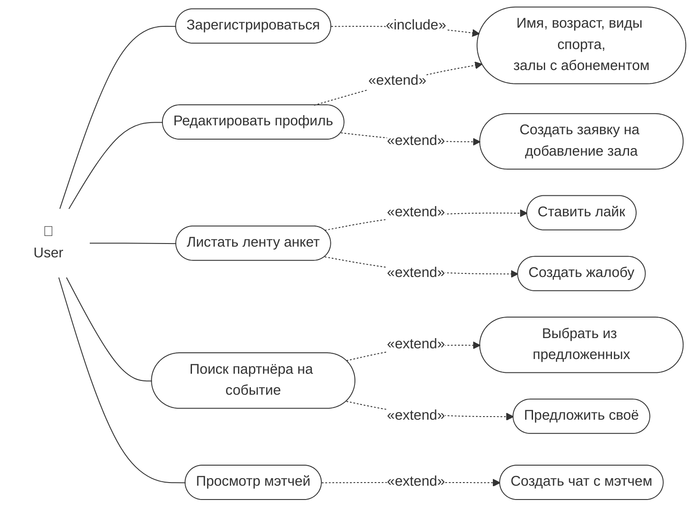
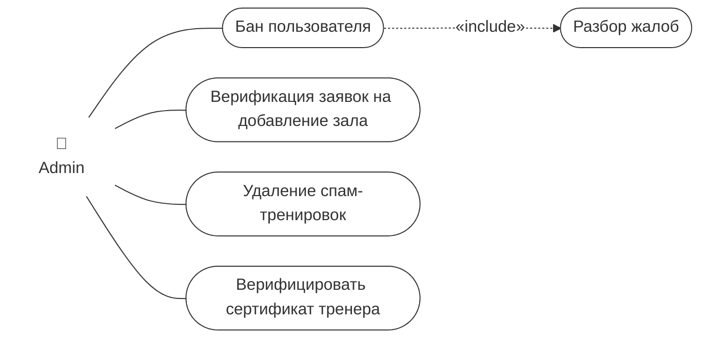
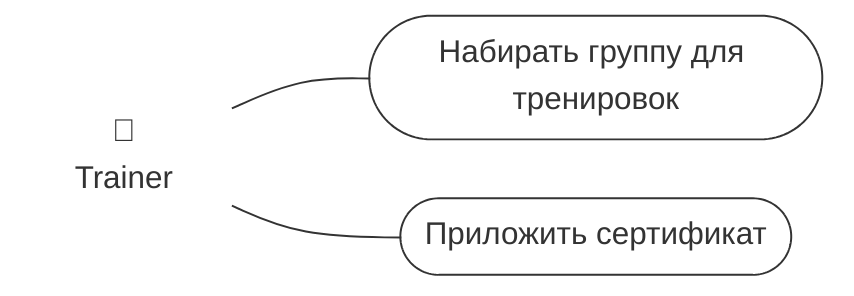
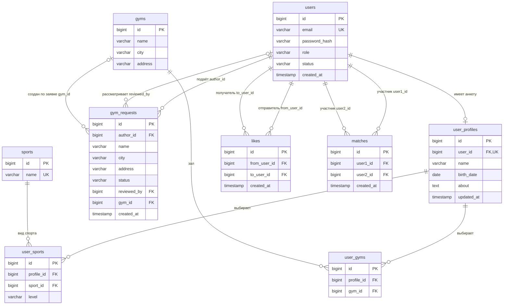

# GymBro

GymBro - это REST API для поиска партнёров по тренировкам. Пользователи
заполняют анкеты, выбирают виды спорта и залы, просматривают ленту и ставят лайки.
Взаимный лайк создаёт мэтч, как в Тиндере.

Swagger UI: http://localhost:8080/swagger-ui.html
OpenAPI JSON: http://localhost:8080/v3/api-docs

## Акторы

| Актор | Описание |
|-------|----------|
| **User** | Пользователь, который ищет напарника для занятий спортом |
| **Trainer** | Тренер, набирающий группы для тренировок (требуется подтверждённый сертификат) |
| **Admin** | Администратор, модерирующий пользователей, залы, тренировки и сертификаты |

### User

### Admin

### Trainer

## Модули и слои

| Модуль | Ответственность |
|---|---|
| `identity` | Учётные записи, BCrypt-хеширование паролей, роли, статусы, текущий пользователь |
| `catalog` | Виды спорта (создание, список, удаление), CRUD залов, подача и рассмотрение заявок |
| `profile` | Анкеты, выбранные виды спорта с уровнем и залы |
| `matching` | Лента, лайки, создание и просмотр совпадений |
| `shared` | Ошибки, валидация перед сохранением, пагинация, OpenAPI |

- `web` отвечает за HTTP-методы, пути, входную валидацию и статусы ответа.
- `dto` описывает запросы и ответы. Entity напрямую в HTTP не отдаётся;
  например, хеш пароля отсутствует в `UserResponse`.
- `api` — Java-интерфейсы сценариев для контроллеров и других модулей.
- `service` проверяет права и бизнес-условия, задаёт границы транзакций.
- `model` содержит сущности, enum и инварианты.
- `repository` отделяет операции хранения от реализации Spring Data JDBC.
  DAO предоставляет стандартные операции, а JDBC-адаптер — необходимые SQL-запросы.

Spring создаёт компоненты и связывает их через конструкторы. Между модулями
используются публичные контракты `api` и разрешённые модели; внутренние сервисы
другого модуля напрямую не вызываются. ArchUnit проверяет архитектурные ограничения.
Модули `events` и `training` в эту лабораторную не входят.

## Схема БД

Типы связей:

- One-to-Many / Many-to-One: пользователь и его заявки на залы (`gym_requests.author_id`), пользователь и лайки (`likes.from_user_id`, `likes.to_user_id`).
- Many-to-Many: анкеты и залы через `user_gyms`.
- Many-to-Many с дополнительным полем: анкеты и виды спорта через `user_sports.level`.
- Дополнительно One-to-One: учётная запись и необязательная анкета.

## Эндпоинты

Префикс всех путей — `/api/v1`. 
Эндпоинты см в Swagger: http://localhost:8080/swagger-ui.html

### Пагинация

Для всех HTTP-списков: `page=0` по умолчанию, `size=20`, максимум 50. Завышенный
size ограничивается настройкой Spring до 50.

## Транзакции

### №1: одобрение заявки на зал

`GymRequestService.approve` выполняется под `@Transactional`:

1. Проверяет активного администратора.
2. Блокирует строку заявки и проверяет статус PENDING.
3. Проверяет отсутствие зала по городу и адресу.
4. Создаёт зал.
5. Сохраняет APPROVED, reviewedBy и gymId в заявке.

Если сохранение решения падает, INSERT зала откатывается, иначе мог бы остаться
зал с незакрытой заявкой.

### №2: лайк и взаимное совпадение

`LikeUserService.like` выполняется под `@Transactional`:

1. Определяет отправителя и проверяет получателя, запрещает лайк самому себе.
2. Получает транзакционную advisory-блокировку PostgreSQL для пары пользователей.
3. Проверяет отсутствие повторного лайка и сохраняет его.
4. Ищет встречный лайк; если он есть, находит или создаёт Match.

Без согласования два встречных запроса могли бы оба не увидеть ещё не
зафиксированный встречный лайк, и совпадение не появилось бы. Одна транзакция
обеспечивает атомарность лайка и совпадения.

### Обновления профиля

Изменение полей и коллекций анкеты также транзакционно. Для существующего профиля
перед изменением берётся блокировка строки. 

## Ошибки

Общий `ApiExceptionHandler` возвращает ProblemDetail (`status`, `title`, `detail`).
Для ошибок полей добавляется `errors`. Статусы: 400 — некорректные данные;
401 — текущий пользователь не определён/не найден; 403 — недостаточно прав или
блокировка; 404 — объект не найден; 409 — дубликат или конфликт состояния;
500 — неожиданная внутренняя ошибка. 

