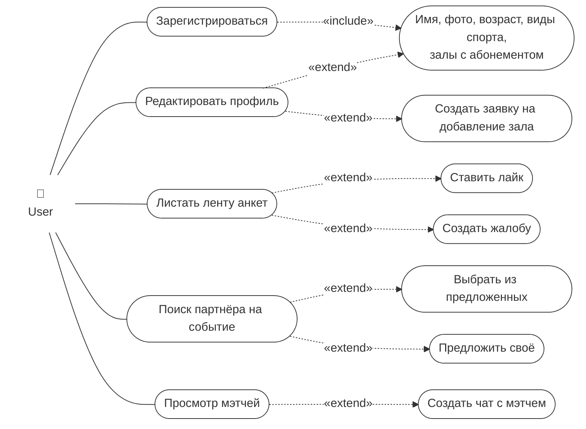
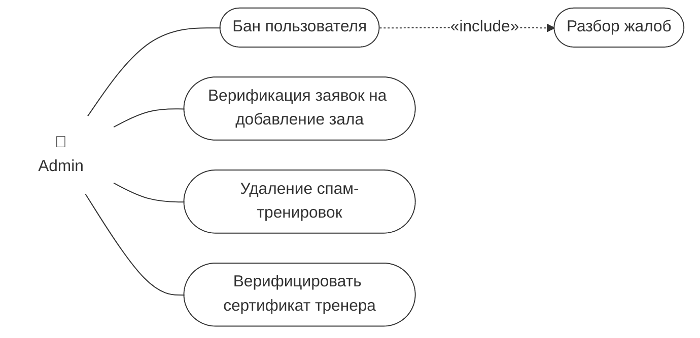
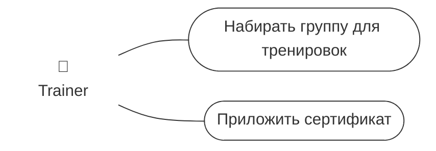

# Поиск напарника на спорт

Сервис для поиска партнёров по тренировкам: пользователи заполняют анкеты, листают ленту, ставят лайки, находят мэтчи и общаются в чате, а также ищут напарников на конкретные спортивные события. Тренеры набирают группы, администраторы модерируют контент.

## Акторы

| Актор | Описание |
|-------|----------|
| **User** | Пользователь, который ищет напарника для занятий спортом |
| **Trainer** | Тренер, набирающий группы для тренировок (требуется подтверждённый сертификат) |
| **Admin** | Администратор, модерирующий пользователей, залы, тренировки и сертификаты |

## Use-case диаграммы

Диаграмма разделена по акторам. Сплошная линия — ассоциация актора со сценарием, пунктирная стрелка — `«include»` / `«extend»`.

### User

### Admin

### Trainer

## Сценарии использования

Для каждого актора указаны сценарии, с которыми он связан напрямую (ассоциация), а вложенными пунктами — сценарии, подключаемые через `<<include>>` / `<<extend>>`.

### User

- **Зарегистрироваться**
  - `<<include>>` Указать имя, фото, возраст, виды спорта, залы с абонементом
- **Редактировать профиль**
  - `<<extend>>` Изменить данные профиля (имя, фото, возраст, виды спорта, залы)
  - `<<extend>>` Создать заявку на добавление зала
- **Листать ленту анкет**
  - `<<extend>>` Ставить лайк
  - `<<extend>>` Создать жалобу
- **Поиск партнёра на событие**
  - `<<extend>>` Выбрать из предложенных
  - `<<extend>>` Предложить своё
- **Просмотр мэтчей**
  - `<<extend>>` Создать чат с мэтчем

### Admin

- **Бан пользователя**
  - `<<include>>` Разбор жалоб
- **Верификация заявок на добавление зала**
- **Удаление спам-тренировок**
- **Верифицировать сертификат тренера**

### Trainer

- **Набирать группу для тренировок**
- **Приложить сертификат**

## Взаимосвязи между ролями

- Жалобы, созданные пользователями из ленты анкет, разбираются администратором и могут привести к бану.
- Заявки на добавление зала, созданные пользователями, проходят верификацию у администратора.
- Сертификат, приложенный тренером, верифицирует администратор.
- Тренировки, созданные тренерами, могут быть удалены администратором как спам.

## Архитектура базы данных

СУБД — PostgreSQL. Структура создаётся миграциями Liquibase/Flyway.

### ER-диаграмма

```mermaid
erDiagram
    users {
        bigint id PK
        varchar email UK
        varchar password_hash
        varchar name
        date birth_date
        text about
        varchar role "USER | TRAINER | ADMIN"
        varchar status "ACTIVE | BANNED"
        timestamptz created_at
    }
    user_photos {
        bigint id PK
        bigint user_id FK
        varchar url
        smallint position
    }
    sports {
        bigint id PK
        varchar name UK
    }
    user_sports {
        bigint user_id PK,FK
        bigint sport_id PK,FK
        varchar level "BEGINNER | INTERMEDIATE | ADVANCED"
    }
    gyms {
        bigint id PK
        varchar name
        varchar city
        varchar address
    }
    user_gyms {
        bigint user_id PK,FK
        bigint gym_id PK,FK
    }
    gym_requests {
        bigint id PK
        bigint author_id FK
        varchar name
        varchar city
        varchar address
        varchar status "PENDING | APPROVED | REJECTED"
        bigint reviewed_by FK
        bigint gym_id FK "заполняется при одобрении"
        timestamptz created_at
    }
    likes {
        bigint from_user_id PK,FK
        bigint to_user_id PK,FK
        timestamptz created_at
    }
    matches {
        bigint id PK
        bigint user1_id FK
        bigint user2_id FK
        timestamptz created_at
    }
    chats {
        bigint id PK
        bigint match_id FK,UK
        timestamptz created_at
    }
    messages {
        bigint id PK
        bigint chat_id FK
        bigint sender_id FK
        text text
        timestamptz sent_at
    }
    complaints {
        bigint id PK
        bigint author_id FK
        bigint target_id FK
        varchar reason "SPAM | FAKE | ABUSE | OTHER"
        text description
        varchar status "NEW | ACCEPTED | REJECTED"
        bigint reviewed_by FK
        timestamptz created_at
    }
    bans {
        bigint id PK
        bigint user_id FK
        bigint admin_id FK
        text reason
        timestamptz created_at
    }
    events {
        bigint id PK
        bigint sport_id FK
        bigint created_by FK
        varchar title
        varchar location
        timestamptz starts_at
        varchar source "SYSTEM | USER"
    }
    event_participants {
        bigint event_id PK,FK
        bigint user_id PK,FK
        boolean looking_for_partner
        varchar comment
        timestamptz joined_at
    }
    certificates {
        bigint id PK
        bigint trainer_id FK
        bigint sport_id FK
        varchar file_url
        varchar status "PENDING | APPROVED | REJECTED"
        bigint reviewed_by FK
        timestamptz created_at
    }
    trainings {
        bigint id PK
        bigint trainer_id FK
        bigint sport_id FK
        bigint gym_id FK
        varchar title
        timestamptz starts_at
        int max_participants
        varchar status "OPEN | FULL | CANCELLED | REMOVED_AS_SPAM"
    }
    training_participants {
        bigint training_id PK,FK
        bigint user_id PK,FK
        varchar status "JOINED | LEFT"
        timestamptz joined_at
    }

    users ||--o{ user_photos : "имеет"
    users ||--o{ user_sports : ""
    sports ||--o{ user_sports : ""
    users ||--o{ user_gyms : ""
    gyms ||--o{ user_gyms : ""
    users ||--o{ gym_requests : "создаёт"
    gyms |o--o| gym_requests : "создан из"
    users ||--o{ likes : "ставит / получает"
    users ||--o{ matches : "участвует"
    matches ||--o| chats : "открывает"
    chats ||--o{ messages : "содержит"
    users ||--o{ messages : "пишет"
    users ||--o{ complaints : "пишет / получает"
    users ||--o{ bans : "получает"
    sports ||--o{ events : ""
    users ||--o{ events : "предлагает"
    events ||--o{ event_participants : ""
    users ||--o{ event_participants : ""
    users ||--o{ certificates : "прикладывает"
    sports ||--o{ certificates : ""
    users ||--o{ trainings : "проводит"
    sports ||--o{ trainings : ""
    gyms |o--o{ trainings : "проходит в"
    trainings ||--o{ training_participants : ""
    users ||--o{ training_participants : ""
```

### Таблицы

| Группа | Таблицы | Назначение |
|--------|---------|------------|
| Профиль | `users`, `user_photos`, `sports`, `user_sports`, `gyms`, `user_gyms` | Анкета: имя, дата рождения (возраст вычисляется), фото, виды спорта с уровнем, залы с абонементом. Роль и статус пользователя хранятся в `users` |
| Залы | `gym_requests` | Заявка пользователя на добавление зала; при одобрении создаётся запись в `gyms`, и заявка ссылается на неё |
| Лента и мэтчи | `likes`, `matches`, `chats`, `messages` | Лайк направленный; мэтч возникает при взаимном лайке; у мэтча не больше одного чата |
| Модерация | `complaints`, `bans` | Жалобы с причиной и статусом разбора; история банов (кто, кого, за что) |
| События | `events`, `event_participants` | События, предложенные системой (`SYSTEM`) или пользователем (`USER`); участник отмечает, ищет ли он напарника |
| Тренер | `certificates`, `trainings`, `training_participants` | Сертификаты с проверкой администратором, групповые тренировки с лимитом мест и их участники |

### Роли

Роль хранится одним полем `users.role` (`USER`, `TRAINER`, `ADMIN`). Тренер обладает всеми правами пользователя (анкета, лента, мэтчи, чаты) и дополнительно может набирать группы. Пользователь регистрируется с ролью `USER`, прикладывает сертификат, и после его одобрения администратором роль меняется на `TRAINER`.

### Связи между сущностями

| Тип связи | Где используется |
|-----------|------------------|
| Many-to-Many | `users ↔ gyms` через `user_gyms` |
| One-to-Many / Many-to-One | `users → user_photos`, `chats → messages`, `users → trainings`, `sports → events`, `users → complaints` и др. |
| Many-to-Many с дополнительным полем | `users ↔ sports` через `user_sports` (`level`), `trainings ↔ users` через `training_participants` (`status`, `joined_at`), `events ↔ users` через `event_participants` (`looking_for_partner`, `comment`), `users ↔ users` через `likes` (`created_at`) |

Все перечисления (`role`, `status`, `level`, `reason`, `source`) хранятся в БД как строки (`@Enumerated(EnumType.STRING)`).

### Ограничения целостности

- `likes`: первичный ключ `(from_user_id, to_user_id)`, `CHECK (from_user_id <> to_user_id)`.
- `matches`: `UNIQUE (user1_id, user2_id)` и `CHECK (user1_id < user2_id)` — у пары ровно один мэтч.
- `chats`: `UNIQUE (match_id)`.
- `users`: `UNIQUE (email)`; `sports`: `UNIQUE (name)`.

### Пагинация

Все `findAll` постраничные, не больше 50 записей за запрос.

| Вид | Где | Почему |
|-----|-----|--------|
| Бесконечная прокрутка (`Slice`, без общего количества) | Лента анкет, сообщения в чате | Общее число не нужно пользователю, а `COUNT(*)` по ленте дорогой |
| Страницы с общим количеством в хедере `X-Total-Count` | Жалобы, заявки на залы, сертификаты (админка) | Администратору важно видеть, сколько записей ждёт разбора |

### Транзакции

| Операция | Шаги | Почему нужна транзакция |
|----------|------|-------------------------|
| Лайк | Вставить лайк → проверить встречный → создать `match` | Иначе при одновременных взаимных лайках может создаться два мэтча или ни одного |
| Бан по жалобе | Изменить `users.status` → записать `bans` → закрыть открытые жалобы на пользователя → снять с будущих тренировок | Частичное выполнение оставит забаненного в группах или с неразобранными жалобами |
| Одобрение заявки на зал | Создать `gyms` → обновить статус заявки → добавить зал автору в `user_gyms` | Зал не должен появиться без закрытия заявки и наоборот |
| Запись на тренировку | Заблокировать тренировку (`SELECT ... FOR UPDATE`) → проверить `max_participants` → добавить участника | Без блокировки при конкурентной записи группа переполнится |
| Одобрение сертификата | Обновить статус сертификата → сменить роль на `TRAINER` | Роль не должна измениться без одобренного сертификата |
